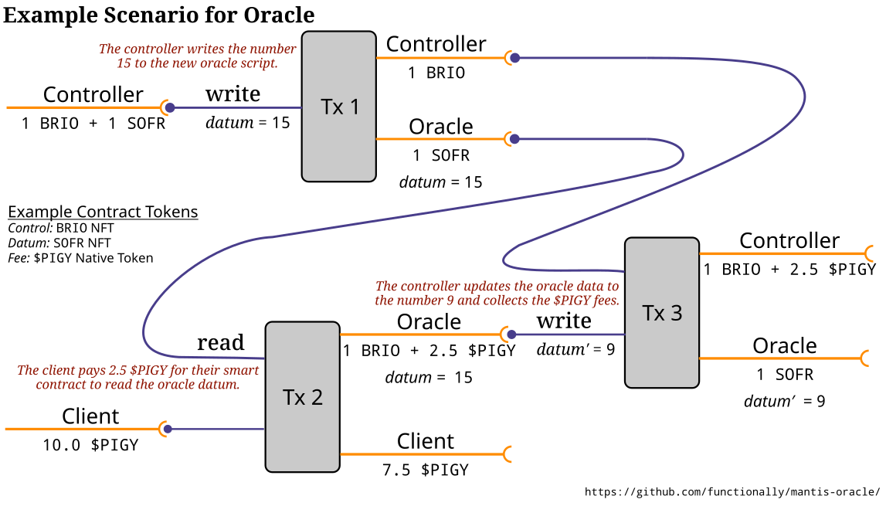

Using the PIGY Oracle Service
=============================

The PIGY Oracle is a community-driven, lowest cost oracle to benefit SPOs. See https://oracle.pigytoken.com/ for details.

This oracle service (a Plutus smart contract) ran on Alonzo Purple, is now running on the Cardano TestNet, and will migrate to the Cardano MainNet immediately after the Alonzo HFC event. To the extent feasible, we will freely add community-nominated data sources to the PIGY Oracle. We have completely open-sourced the on- and off-chain code so that the Cardano community can easily deploy their own customized oracles for whatever data feeds they wish.

Data Format
-----------

In addition to being posted on the blockchain as eUTxO data at the smart-contract address [`addr_test1wquuc74u5r702y8jpazgm3nusse6jaj68cm2xqyzyqhyu8g25ysjg`](https://explorer.cardano-testnet.iohkdev.io/en/address?address=addr_test1wquuc74u5r702y8jpazgm3nusse6jaj68cm2xqyzyqhyu8g25ysjg), for convenience the data is also posted in the eUTxO as metadata with tag 247428 and at [ipns://k51qzi5uqu5dgsw6m8og2thi7kzs9lxjb7w0y4r20u0lkrm92vuqja644v6ray](http://gateway.pinata.cloud/ipns/k51qzi5uqu5dgsw6m8og2thi7kzs9lxjb7w0y4r20u0lkrm92vuqja644v6ray).

The service currently posts currency and precious metal spot prices. Here is [an example](https://explorer.cardano-testnet.iohkdev.io/en/transaction?id=d0cca8b82263a4c1ad2c4f845ab58ed5610fdb1fcbe76faa92d19ef5aa2655b2):

    {
      "timestamp": "2021-09-01T20:44:32+00:00",
      "service": "https://oracle.pigytoken.com",
      "currencies": {
        "source": "https://notnullsolutions.com",
        "symbols": [
          { "symbol": "EUR", "value":   84470, "scale": 100000, "unit": "EUR/USD" },
          { "symbol": "GBP", "value":   72632, "scale": 100000, "unit": "GBP/USD" },
          { "symbol": "IDR", "value": 1424895, "scale":    100, "unit": "IDR/USD" }
        ]
      },
      "metals": {
        "source": "https://notnullsolutions.com",
        "symbols": [
          { "symbol": "Au", "value": 181367, "scale": 100, "unit": "USD/ounce" },
          { "symbol": "Ag", "value":   2416, "scale": 100, "unit": "USD/ounce" },
          { "symbol": "Pt", "value":   1007, "scale":   1, "unit": "USD/ounce" },
          { "symbol": "Pd", "value":   2451, "scale":   1, "unit": "USD/ounce" }
        ]
      },
      "nyfed": {
        "source": "https://www.newyorkfed.org/markets/reference-rates/sofr",
        "symbols": [
          { "symbol": "SOFR", "value": 5, "scale": 100, "unit": "%" }
        ]
      }
    }

Because Plutus does not have a data type for real (floating point) numbers, the prices are represented as a value divided by a scale. Here is how to interpret the example above:

| Item           | Price               |
|----------------|--------------------:|
| EUR            |     0.84470 EUR/USD |
| GBP            |     0.72632 GBP/USD |
| IDR            | 14248955    IDR/USD |
| Au (Gold)      |  1813.67 USD/ounce  |
| Ag (Silver)    |    24.16 USD/ounce  |
| Pt (Platinum)  |  1007    USD/ounce  |
| Pd (Palladium) |  2451    USD/ounce  |
| SOFR           |     0.05%           |

Technical Details
-----------------

See [`mantra-oracle`](https://github.com/functionally/mantra-oracle/blob/main/ReadMe.md) for complete technical details and source code.

The oracle users three types of native tokens:

*   The **fee** token: Each time another smart contract reads data from the oracle, it needs to pay a quantity of the *fee token* to the oracle contract.
*   The **datum** token: The oracle always has at its address an eUTxO that holds the *datum token*, and the oracle's data is attached to this eUTxO.
*   The **control** token: The operator of the oracle uses the *control token* to update the data in the oracle by sending it in a transaction with new data for the datum token to hold. (This token can also be used to delete the oracle altogether, ending its smart contract.)

Reading the Oracle Datum
------------------------

On the Cardano TestNet, the oracle resides at [`addr_test1wquuc74u5r702y8jpazgm3nusse6jaj68cm2xqyzyqhyu8g25ysjg`](https://explorer.cardano-testnet.iohkdev.io/en/address?address=addr_test1wquuc74u5r702y8jpazgm3nusse6jaj68cm2xqyzyqhyu8g25ysjg). The compiled Plutus code for the oracle is in [testnet.plutus](testnet.plutus). The source code is in the [`mantra-oracle`](https://github.com/functionally/mantra-oracle/blob/main/ReadMe.md) Haskell package.

The configuration [testnet.mantra-oracle](testnet.mantra-oracle) requires that `10 tPIGY` tokens be paid to the oracle when reading it and that no ADA may be withdrawn from the oracle when reading it. The datum token is `1 PIGSTY`.

Although the oracle is meant to be read by other smart contracts, it can also be read using the [`cardano-cli`](https://github.com/input-output-hk/cardano-node/blob/master/cardano-cli/README.md) tool. See the script [read-oracle-eutxo.sh](read-oracle-eutxo.sh) for an example.

Creating the Oracle Datum
-------------------------

The script [create-oracle-eutxo.sh](create-oracle-eutxo.sh) creates the oracle with new precious metal and currency prices. The control token is `1 FARM`.

Updating the Oracle Datum
-------------------------

The script [update-oracle-eutxo.sh](update-oracle-eutxo.sh) updates the oracle with new precious metal and currency prices.
